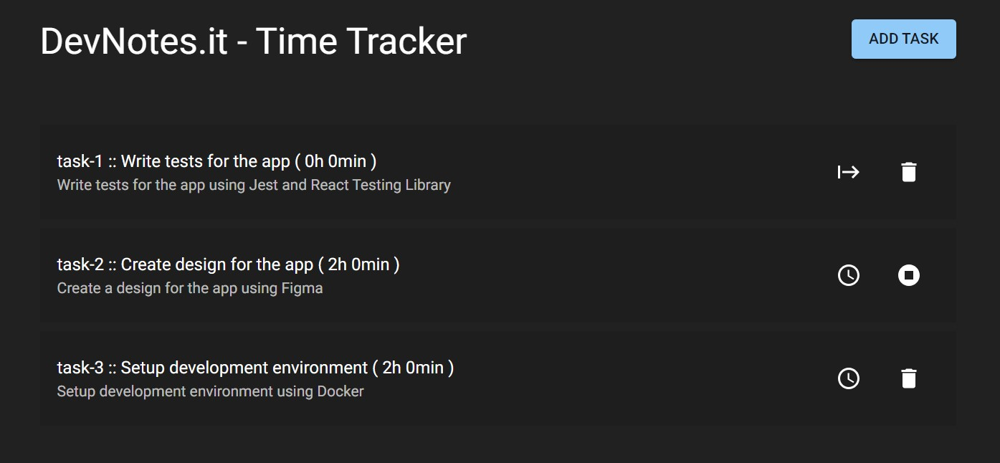
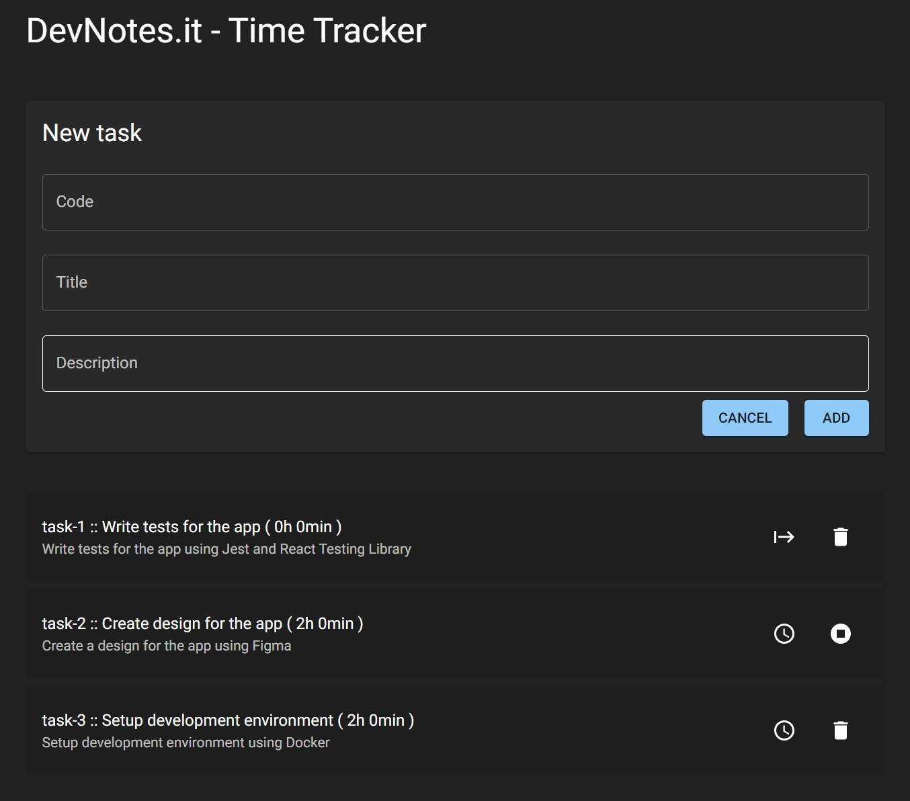
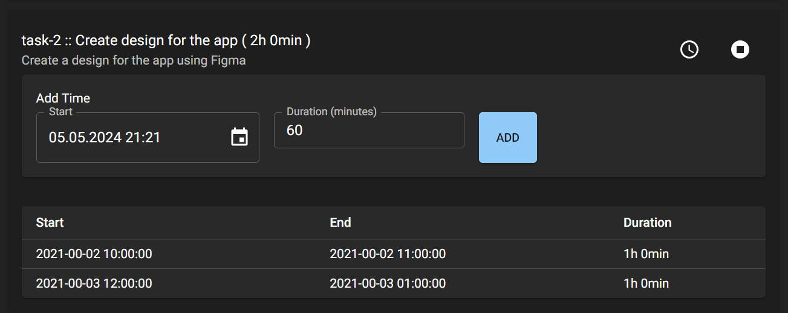

# Creating basic FE app

Having configured dev environment (described on `dev-enviroment-setup` branch), we can now create a basic TimeTracker FE app using:
- MaterialUI
- ReactForms
- Zod

## Functional requirements

Our app must allow users to:
- List of all tasks with total spent time (including filtering by status, searching by title or code)
- Add new task
- Add time spent on specyfic task
- Close task

## User flow / UI requirements

1. User opens app and sees list of tasks.
  On top there is search input to filter tasks by task code, title or description content.
  Beside that there is switch open/close which allows to show only open or closed tasks.
  List of tasks contains:
    - task code
    - task title 
    - task description
    - total time spent on task
    - "track time" button to open list of times and form to register new time ( form visible only for `IN_PROGRESS` tasks)
    - close button (visible only for `TODO` and `IN_PROGRESS` tasks)

2. User can filter tasks by title and statuses
3. User can add new task by clicking add button which shows form that contains task code, title and description. Submitting form adds task as open and is visible on top of the list. 
4. User can add time spent on task by entering time in minutes into input which is located next to the task. Submitting form adds time to task and updates total time spent on task.
5. User can close task
6. User can delete task only those that are not started or are closed

## Technical requirements

- Store tasks State using Context API
- Use MaterialUI for styling
- Use ReactForms for form handling
- Use Zod for validation

## Basic Designs

Main view


New Task


Time Entries / Form


## Implementation

Start development enviroment by running:
- `./startdev.sh` - to start docker dev container
- `npm i` - to install necessary packages

### Install necessary packages

**MaterialUI** for styled components
```bash
npm install @mui/material-nextjs @mui/material @emotion/cache @emotion/react @emotion/styled @mui/icons-material @mui/x-date-pickers
```

**Zod** for validation
```bash
npm install zod 
```

**ReactForm** for form handling
```bash
npm install react-hook-form @hookform/resolvers
```

**ReactQuery** for communication with API
```bash
npm install @tanstack/react-query
```

**luxon** for date handling
```bash
npm install luxon @types/luxon
```

**uuid** for generating unique ids
```bash
npm install uuid
```


---
**Please verify if you have same package versions installed as in `package.json` if you want to be sure that it'll work as described in this document**
---

### Confugure MaterialUI

You can proceed with configuration described in [MaterialUI's Next.JS integration documentation](https://mui.com/material-ui/integrations/nextjs/)

In short:
1. In `app/layout.tsx`:
    - remove css imports
    - `import { AppRouterCacheProvider } from "@mui/material-nextjs/v14-appRouter"` 
    - wrap `body` content with `AppRouterCacheProvider`
2. Create theme file in `ui/mui/theme.ts` - you can use default theme from MaterialUI documentation
3. In `app/layout.tsx`:
    - `import { ThemeProvider } from "@mui/material/styles"`
    - wrap `body` content with `ThemeProvider` and pass theme as prop
4. In `app/page.tsx` replace jsx with MUI components

** Now you can use MaterialUI components in your app **

### Define types

Create types in `utils/types` using `zod` for validation:
- `status.ts` - ENUM with status values: `TODO`, `IN_PROGRESS`, `DONE`

- `time.ts` - Time type with validation:
  - `start` - start time as `DateTime` from `luxon`
  - `duration` - duration in minutes as number

- `task.ts` - Task type with validation schema which:
  - has `code` as string
  - has `title` as string
  - has `description` as string
  - has `status` as `STATUS` enum
  - has `timeSpent` as array of `TIME` type


### Create Reducer with Context for tasks

Create Reducer with shared state for tasks in `utils/reducers/tasks.ts`, which:
- has `tasks` as array of `TASK` type
- has `dispatch` function which allows to:
  - add new task
  - add time to task
  - change task status

Modify `app/layout.tsx` to wrap `body` content with `TasksProvider`

### Create TaskList component

In `ui/components` prepare components:
- `header.tsx` - which contain header text and button to add new task next to header
- `tasksList.tsx` - which contain list of tasks with filtering and search input
- `tasksListItem.tsx` - which contain single task with time spent input, add time button, change status (start, end task if not `Done`) and delete button


### Create TaskForm component

In `ui/components` prepare components:
- `taskForm.tsx` - which contain form which uses `react-hook-form` to handle form state and validation using `zod` schema

### Add actions to change statuses 

When clicking proper button in `tasksListItem` component, proper action should be dispatched to change task status:
- when start then status is set to `IN_PROGRESS`
- when end then status is set to `DONE`
- when delete then task is removed from list

### Add actions to add time to task

When clicking add time button in `tasksListItem` component, list of registered times for that task is expanded bellow this task. 
On top there is a form to add time spent on task. After submitting form, time is added to task and total time spent on task is updated.


